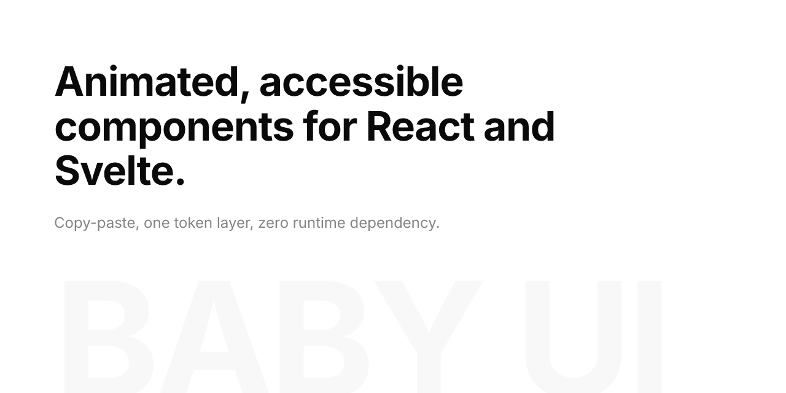

<p align="center">
  
</p>

<p align="center">
  Animated, accessible components for React and Svelte.<br />
  Copy-paste, one token layer, zero runtime dependency.
</p>

<p align="center">
  <a href="https://baby-ui.nexonauts.com">Site</a> ·
  <a href="https://baby-ui.nexonauts.com/docs">Docs</a> ·
  <a href="https://baby-ui.nexonauts.com/components">Components</a> ·
  <a href="LICENSE">Apache-2.0</a>
</p>

## What this is

145+ components, each built once from a shared spec and shipped as a real React port and a
real Svelte port: same props, same motion, same accessibility contract, no framework-specific
compromise in either one. Installs like shadcn/ui: the CLI copies source into your project,
nothing is imported at runtime.

```bash
npx shadcn@latest add https://baby-ui.pages.dev/r/button.json
npx shadcn-svelte@latest add https://baby-ui.pages.dev/svelte/r/button.json
```

Base primitives on Base UI (React) and bits-ui (Svelte), charts on d3 and SVG, one CSS token
layer for both ports, motion that respects `prefers-reduced-motion` throughout.

## Development

- `pnpm install`, then `pnpm dev` (root) starts the docs site; `pnpm playground` starts the
  React/Svelte isolated runners. Every dev server runs through [portless](https://portless.sh),
  so it's `site.baby-ui.localhost` and friends, not a port to remember.
- `pnpm dev:list` / `pnpm dev:stop` show and clean up running dev servers.
- `pnpm check`, `pnpm lint`, `pnpm build` run the same gates CI does.
- Agent and contributor rules live in [`.agents/rules.md`](.agents/rules.md); deployment
  topology is in [`DEPLOYMENT.md`](DEPLOYMENT.md).

## License

Apache-2.0, see [`LICENSE`](LICENSE). Ported component licenses are credited per-component
in [`THIRD_PARTY_LICENSES.md`](THIRD_PARTY_LICENSES.md).
